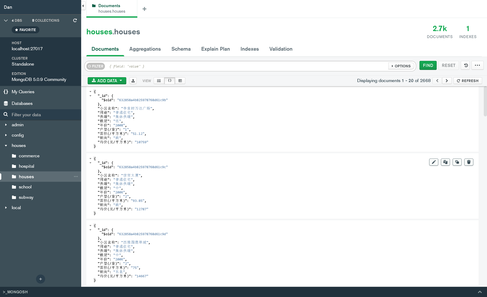
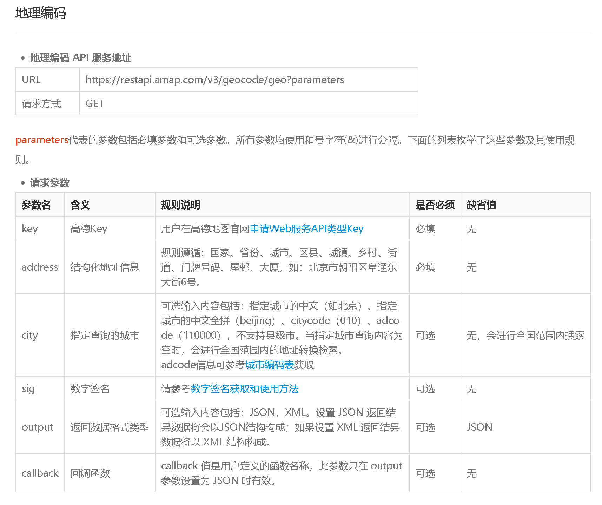
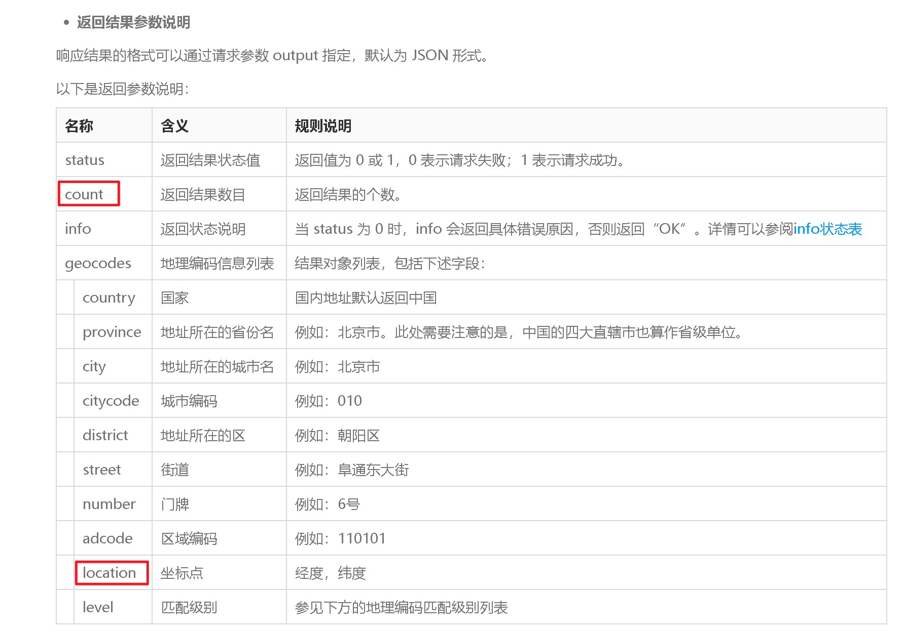
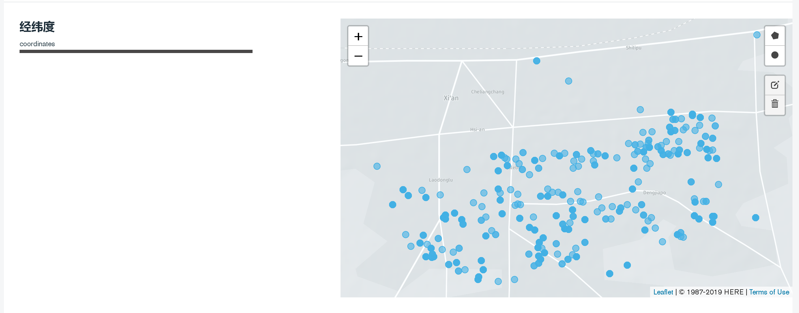

#                      西安市碑林区二手房价格预测
##                                             **作者**： 能动B2104 杨牧天

###                                                                  ***绪论***

&ensp;&ensp;在当今社会，房地产行业作为中国的支柱产业之一具有十分重要的地位，房地产市场具有<u>高度持有，多数沉淀</u>的市场模式，这决定了其只需小部分的退出渠道便可维持正常运转，相比于新房市场，二手房交易由于其兼顾**进入**与**退出**两大功能，在维持房产价值的稳定中起到极其重要的作用。

​    本文基于Python网络爬虫，基于高德API的地理编码与POI获取技术，机器学习技术等，对获取的样本数据进行处理与学习，并构建西安市碑林区房价预测数学模型。

​	第一部分内容为Python网络爬虫获取原始数据；本文爬取了[贝壳二手房网站](https://xa.ke.com/ershoufang/beilin/)上2022年度的西安市碑林区二手房数据作为房源信息的原始数据。

​	第二部分内容为使用[高德API](https://console.amap.com/dev/index)进行碑林区各项影响房价因素信息的获取；本文通过Python构建URL提交表单的方式，获取了碑林区各大医院，中小学，商业中心，地铁站的经纬度坐标，供后续数据计算使用。至此，数据准备阶段结束。<br>

​	第三部分为神经网络监督学习构造预测模型；利用Python进行神经网络的搭建，核心算法为k聚类算法，根据肘部法则确定k点数目，搭建回归模型。


# 一. 数据的收集


## 1.本部分用到的Python库

```python
import csv
import aiohttp # 爬虫的协程版本
import asyncio
import pymongo
import logging # 编写日志
import aiofiles # 文件处理的协程版本
import json
import re # 基本库，用于正则表达式的匹配
import numpy as np # 用于科学计算
from motor.motor_asyncio import AsyncIOMotorClient # pymongo的协程版本
from bs4 import BeautifulSoup
from pyquery import PyQuery as pq # html解析库，类似bs4
```


## 2. 定义Crawler类

### [crawler.py](./file/crawler.py)
>Crawler类的基本架构
>>==\_\_init\_\_==: 类的初始化状态
>>
>>==scrape\_html==**: 爬取html的通用函数
>>
  ==get\_area==: 获取[area.json](./file/area.json)文件中关于爬取二手房类型的描述

>>==get\_url==: 进行URL的格式化编辑，返回指定网址
>>
>>==get\_page==: 获取当前网页最大页数
>>
>>==parse_html==**: 解析网页html， 获取二手房各项信息
>>
>>>（小区名称 供暖 均价 年份 户型 朝向 楼层 用途）

>>==split\_text==: 处理爬取的初始数据，转为json格式
>>
>>==save\_data\_mongo\_db==: 将数据保存在mongodb数据库
>>==save\_data\_csv==: 将数据保存为csv文件格式


### mongodb保存格式:




### csv保存格式：[houses.csv](./file/houses.csv)


### json保存格式: [houses.json](./file/houses.json)


# 二. 使用高德API进行数据收集


## 1. 查看高德地理编码API文档

* [地理编码 API](https://lbs.amap.com/api/webservice/guide/api/georegeo)
* [搜索POI API](https://lbs.amap.com/api/webservice/guide/api/search)


## 2. 确定所需返回参数


## 3. 编写通用类LatitudeLongitude

### [latitude_longitude.py](./file/latitude_longitude.py)

### latitude_longitude 的作用

1. 以提交表单的形式建立与API之间的联系
2. 获取参数params，构建URL提交并获取返回信息
3. 处理返回数据，获取经纬度


## 4. 进行数据的获取

### [select_house.py](./file/select_house.py)
### 获取的数据（碑林区）：
* [三级甲等医院](./file/hospital.json) 
* [中小学](./file/school.json)
* [地铁](./file/subway.json)
* [购物中心](./file/commerce.json)

### 更新的数据：

* [碑林区二手房](./file/houses.json)


# 二.  数据预处理

## 1. 本部分需要的Python库

```python
import json
import numpy as np
```


## 2. 符号声明

| 名称     | 符号表达式 | 量化方案                      | 举例                         |
| -------- | ---------- | ----------------------------- | ---------------------------- |
| 年份     | $y$        | $2022-{y^,}$                  | $y=2022-2014=8$              |
| 用途     | $u$        | $u=\{1~or~2\}$                | $u=普通住宅=1$               |
| 供暖方式 | $w$        | $w=\{1~ or~2\}$               | $w=自供暖=1$                 |
| 楼层高度 | $h$        | $h=\{1, 2\}$                  | $h=\{低:1，中:2，高:1\}$     |
| 户型     | $c$        | $c={c^,}$                     | $c=3$                        |
| 面积     | $s$        | $s={s^,}$                     | $s=51.12$                    |
| 朝向     | $t$        | $t=\{1,2,3\}$                 | $t=\{南:3,北:2,东:1,西:1\}$  |
| 经纬度   | $loa$      | $loa={loa^,}$                 | $loa=[108.96054, 34.243889]$ |
| POI      | $P$        | $P=周围3km内有指定场所的个数$ | $P=3$                        |
| 均价     | $m$        | $m={m^,}$                     | $m=10795$                    |

### 更新方法：[update_data.py](./file/update_data.py)


## 3. 数据预处理


### 观察二手房集群



> **观察图中定位点，数据集合度较高，不存在明显误差**


### 数据归一化

#### 公式

$$
{x}_{normalization}=\frac{x-\mu }{\sigma }
$$

#### Python实现

[minmax.py](./file/minmax.py)

```python
def min_max(data_list):
    mean = np.mean(data_list)
    std = np.std(data_list)
    return (data_list-mean)/std
```


### 生成POI数据

$$
haversin(\frac{d}{R})=haver({\phi_2-\phi_1})+cos(\phi_1)cos(\phi_2)haversin(\Delta\lambda)\\
haversin(\theta)={sin^2(\frac{\theta}{2})}=\frac{1-cos(\theta)}{2}\\
$$

+ $R$ 为地球半径，可取平均值$6371km$
+ ${\phi_1},{\phi_2}$表示两点的纬度
+ $\Delta\lambda$表示两点经度的差值

#### Python实现

[POI.py](./file/POI.py)

```python
def distance(dis_1, dis_2):
    lon1, lat1 = dis_1
    lon2, lat2 = dis_2
    lon1, lat1, lon2, lat2 = map(np.radians, np.array([lon1, lat1, lon2, lat2]))

    d_lon = lon2 - lon1
    d_lat = lat2 - lat1
    aa = np.sin(d_lat / 2) ** 2 + np.cos(lat1) * np.cos(lat2) * np.sin(d_lon / 2) ** 2
    c = 2 * np.arcsin(np.sqrt(aa))
    r = 6371
    return c*r*1000
```


# 三. 神经网络学习

##  [main.py](./file/main.py)


## 1. 本部分用到的Python库

```python
from sklearn.model_selection import train_test_split
from sklearn.neighbors import KNeighborsClassifier
```


## 2. 训练集与测试集的生成


### Python实现

```python
data = POI.poi()
X, y = data[:-3]+data[-1], data[-3]

X_train, X_test, y_train, y_test = train_test_split(X, y.astype(int)data = POI.poi()
data = np.array(data)
X, y = data[[True, True, True, True, True, True, True, False, False, True]], data[-3]

X_train, X_test, y_train, y_test = train_test_split(X.T, y.astype(int), random_state=0), random_state=0)
```


## 3. 训练模型并检验

### Python实现

```python
clf = KNeighborsClassifier(n_neighbors=3)
clf.fit(X_train, y_train)
precision = clf.score(X_test, y_test)
print(precision)
```

### 训练精度

```python
0.7692307692307693
```


# 四. 附录


## 1. crawler.py

```python
# -*- coding: utf-8 -*-
# @Time : 2022/9/17 0:09
# @Author : DanYang
# @File : crawler.py
# @Software : PyCharm
import csv
import aiohttp
import asyncio
import logging
import aiofiles
import json
import re
from motor.motor_asyncio import AsyncIOMotorClient
from pyquery import PyQuery as pq

logging.basicConfig(level=logging.INFO,
                    format='%(asctime)s - %(levelname)s: %(message)s')


class Crawler:
    def __init__(self):
        self.BASE_URL = 'https://xa.ke.com/ershoufang/beilin/{page}{heating}{application}/'

        self.CONCURRENCY = 10
        self.SEMAPHORE = asyncio.Semaphore(self.CONCURRENCY)
        self.TIMEOUT = aiohttp.ClientTimeout(total=10)

        self.MONGO_CONNECTION_STRING = 'mongodb://localhost:27017'
        self.MONGO_DB_NAME = 'houses'
        self.MONGO_COLLECTION_NAME = 'houses'

    async def scrape_html(self, url):
        session = aiohttp.ClientSession(timeout=self.TIMEOUT)
        logging.info('scraping %s', url)
        async with self.SEMAPHORE:
            try:
                response = await session.get(url)
                logging.info('success scrap %s', url)
                return (await response.text()).replace('\xa9', '')
            except aiohttp.ClientError:
                logging.error('error occurred while scraping %s', url, exc_info=True)
                return None
            finally:
                await session.close()

    async def get_area(self):
        async with aiofiles.open('area.json', 'r') as file:
            return json.loads(await file.read())

    async def get_url(self, params):
        return self.BASE_URL.format(**params)

    async def get_page(self, html):
        content = pq(html)
        div = content('div[comp-module="page"]')
        page = re.search('"totalPage":([0-9]*)', div.attr('page-data')).group(1)
        return int(page)

    async def parse_html(self, html):
        content = pq(html)
        try:
            address_list = content('div[data-component="list"] ul.sellListContent li div div.address').items()
            flood = [address('div.flood div a').text() for address in address_list]
            patterns = re.compile('<span class="houseIcon"></span>(.*?)</div>', re.S)
            house_info = [re.sub('\s', '', house) for house in re.findall(patterns, html)]
            price_info_list = content('div[data-component="list"] ul.sellListContent li div div.priceInfo').items()
            price = [price_info('div.unitPrice span').text() for price_info in price_info_list]
            return flood, house_info, price
        except AttributeError:
            logging.error('error occurred while parsing %s...', html[:50])
            return None

    async def split_text(self, tuple_text):
        flood, house_info, price = tuple_text
        if not (len(flood) == len(house_info) == len(price)):
            return None
        house_info = [house.split('|') for house in house_info]

        flood_result = []
        price_result = []
        house_result = []
        for i, house in enumerate(house_info):
            if len(house) != 5:
                continue
            try:
                house[0] = re.search('([低中高地下室]*)', house[0]).group(1)
                house[1] = re.search('([0-9]*)年', house[1]).group(1)
                house[2] = re.search('([0-9]*)室', house[2]).group(1)
                house[3] = re.search('([0-9.]*)平米', house[3]).group(1)
                price[i] = re.search('([0-9]*)元', price[i].replace(',', '')).group(1)

                flood_result.append(flood[i])
                price_result.append(price[i])
                house_result.append(house)
            except AttributeError:
                continue

        return flood_result, house_result, price_result

    async def save_data_mongo_db(self, data_tuple):
        logging.info('saving data')

        client = AsyncIOMotorClient(self.MONGO_CONNECTION_STRING)
        db = client[self.MONGO_DB_NAME]
        collection = db[self.MONGO_COLLECTION_NAME]

        floods, houses, prices, application, heat = data_tuple
        fieldnames = ['小区名称', '用途', '供暖', '楼层', '年份', '户型(/室)', '面积(/平方米)', '朝向', '均价(元/平方米)']
        for flood, house, price in zip(floods, houses, prices):
            results = [flood, application, heat] + house + [price]
            condition = dict(zip(fieldnames, results))
            await collection.insert_one(condition)

        logging.info('success save data')

    async def save_data_csv(self, data_tuple):
        logging.info('saving data')
        floods, houses, prices, application, heat = data_tuple
        fieldnames = ['小区名称', '用途', '供暖', '楼层', '年份', '户型(/室)', '面积(/平方米)', '朝向', '均价(元/平方米)']
        for flood, house, price in zip(floods, houses, prices):
            results = [flood, application, heat] + house + [price]
            condition = dict(zip(fieldnames, results))
            with open('data.csv', 'a', newline='', encoding='gbk') as csvfile:
                writer = csv.DictWriter(csvfile, fieldnames=fieldnames)
                try:
                    writer.writerow(condition)
                except AttributeError:
                    pass

    async def main(self):
        area = (await self.get_area())[0]
        applications = area['application']
        heats = area['heating']
        for application in applications:
            for heat in heats:
                params = {
                    'application': application,
                    'heating': heat,
                    'page': 'pg1'
                }
                text_html = await self.scrape_html(await self.get_url(params))
                page = await self.get_page(text_html)
                for i in range(1, page + 1):
                    params['page'] = 'pg' + str(i)
                    result_url = await self.get_url(params)
                    result_html = await self.scrape_html(result_url)
                    result_flood, result_house, result_price = await self.parse_html(result_html)
                    result_flood, result_house, result_price = await self.split_text((result_flood,
                                                                                      result_house, result_price))
                    data = (result_flood, result_house, result_price,applications[application], heats[heat])
                    await self.save_data_mongo_db(data)
                    # await self.save_data_csv(data)


if __name__ == '__main__':
    loop = asyncio.get_event_loop()
    spider = Crawler()
    loop.run_until_complete(spider.main())

```

## 2. select_house.py

```python
# -*- coding: utf-8 -*-
# @Time : 2022/9/19 13:48
# @Author : DanYang
# @File : select_house.py
# @Software : PyCharm
import latitude_longitude
import pymongo

client = pymongo.MongoClient(host='localhost', port=27017)
db = client['houses']


def save_data(collection, location, name):
    for loc, nam in zip(location, name):
        print(loc, nam)
        collection.insert_one({nam: loc})


if __name__ == '__main__':
    selection = latitude_longitude.LatitudeLongitude()

    h_location, h_name = selection.get_poi_loc('三级甲等医院')

    ms_location, ms_name = selection.get_poi_loc('中学')
    ps_location, ps_name = selection.get_poi_loc('小学')
    ms_location.extend(ps_location)
    ms_name.extend(ps_name)

    w_location, w_name = selection.get_poi_loc('地铁')

    c_location, c_name = selection.get_poi_loc('购物中心;商场')

    hospital_collection = db['hospital']
    school_collection = db['school']
    subway_collection = db['subway']
    commerce_collection = db['commerce']

    save_data(hospital_collection, h_location, h_name)
    save_data(school_collection, ms_location, ms_name)
    save_data(subway_collection, w_location, w_name)
    save_data(commerce_collection, c_location, c_name)
```

## 3. update_data.py

```python
# -*- coding: utf-8 -*-
# @Time : 2022/9/21 17:15
# @Author : DanYang
# @File : update_data.py
# @Software : PyCharm
import json


def pre_data(data):
    if data['用途'] == '普通住宅':
        data['用途'] = 1
    else:
        data['用途'] = 2

    if data['供暖'] == '集体供暖':
        data['供暖'] = 2
    else:
        data['供暖'] = 1

    if data['楼层'] == '中':
        data['楼层'] = 2
    else:
        data['楼层'] = 1

    data['年份'] = 2022 - int(data['年份'])
    data['户型(/室)'] = int(data['户型(/室)'])
    data['面积(/平方米)'] = float(data['面积(/平方米)'])
    if '南' in data['朝向']:
        data['朝向'] = 3
    elif '北' in data['朝向']:
        data['朝向'] = 2
    else:
        data['朝向'] = 1

    data['均价(元/平方米)'] = float(data['均价(元/平方米)'])
    return data


if __name__ == '__main__':
    with open('houses.json', 'r', encoding='utf-8') as file:
        results = json.loads(file.read())
    for i, result in enumerate(results):
        print(i, result)
        new_result = pre_data(result)
        results[i] = new_result

    with open('new_houses.json', 'w') as file:
        file.write(json.dumps(results, indent=3, ensure_ascii=False)
```

## 4. latitude_longitude.py

```python
# -*- coding: utf-8 -*-
# @Time : 2022/9/18 17:26
# @Author : DanYang
# @File : latitude_longitude.py
# @Software : PyCharm
import requests
from bs4 import BeautifulSoup


class LatitudeLongitude:
    def __init__(self):
        self.SESSION = requests.Session()
        self.BASE_URL = 'https://restapi.amap.com/v3/geocode/geo?' \
                        'address={address}&city=西安&key=dd36390ef3c7b9ce04136c408a65e854'
        self.POI_URL = 'https://restapi.amap.com/v3/place/text?types={types}' \
                       '&city=610103&offset=20&page={page}&key=dd36390ef3c7b9ce04136c408a65e854'

    def submit_house(self, params, url):
        new_url = url.format(**params)
        response = self.SESSION.get(new_url)
        if url == self.BASE_URL:
            return response.text
        else:
            return response.json()

    def get_loa(self, name):
        params = {'address': name}
        html = self.submit_house(params, self.BASE_URL)
        try:
            content = BeautifulSoup(html)
            location = content.location.string
        except AttributeError:
            return None
        location = [float(i) for i in location.split(',')]
        return location

    def get_poi_loc(self, types):
        params = {
            'types': types,
            'page': '1'
        }
        html = self.submit_house(params, self.POI_URL)
        count = html['count']
        total_page = int(count) // 20 + 1
        names = []
        locations = []
        for i in range(1, total_page + 1):
            params['page'] = str(i)
            html = self.submit_house(params, self.POI_URL)
            for poi in html['pois']:
                names.append(poi['name'])
                locations.append([float(i) for i in poi['location'].split(',')])
        return locations, names
```

## 5. coordinate.py

```python
# -*- coding: utf-8 -*-
# @Time : 2022/9/18 19:43
# @Author : DanYang
# @File : coordinate.py
# @Software : PyCharm
import json
import latitude_longitude
import logging

logging.basicConfig(level=logging.INFO,
                    format='%(asctime)s - %(levelname)s: %(message)s')


class Coordinate(latitude_longitude.LatitudeLongitude):
    def __init__(self):
        super().__init__()
        self.HOUSES_JSON = 'houses.json'
        self.FACILITIES_JSON = 'facilities.json'

    def update_facilities(self):
        with open('facilities.json', 'r', encoding='utf-8') as file:
            facilities = json.loads(file.read())
        h_location = []
        s_location = []
        w_location = []
        for hospital in facilities[0]['hospital']:
            print(hospital)
            h_location.append(list(self.get_loa(hospital)))
        for school in facilities[0]['school']:
            print(school)
            s_location.append(list(self.get_loa(school)))
        for subway in facilities[0]['subway']:
            print(subway)
            w_location.append(list(self.get_loa(subway+'地铁站')))

        facilities[0]['hospital'] = dict(zip(facilities[0]['hospital'], h_location))
        facilities[0]['school'] = dict(zip(facilities[0]['school'], s_location))
        facilities[0]['subway'] = dict(zip(facilities[0]['subway'], w_location))

        with open('facilities.json', 'w') as file:
            file.write(json.dumps(facilities, ensure_ascii=False, indent=3))

    def update_houses(self):
        with open('houses.json', 'r', encoding='gbk') as file:
            houses = json.loads(file.read())
        result_house = []
        with open('new_houses.json', 'a') as file:
            for i, house in enumerate(houses):
                name = house['小区名称']
                location = self.get_loa(name)
                if not location:
                    continue
                house['经纬度'] = location
                result_house.append(house)
                logging.info('update %s successfully (index:%d)', house, i)
            file.write(json.dumps(result_house, indent=3, ensure_ascii=False))


if __name__ == '__main__':
    coordinate = Coordinate()
    # coordinate.update_facilities()
    coordinate.update_houses()
```

## 6. common.py

```python
# -*- coding: utf-8 -*-
# @Time : 2022/9/18 17:46
# @Author : DanYang
# @File : common.py
# @Software : PyCharm
import numpy as np


def distance(dis_1, dis_2):
    lon1, lat1 = dis_1[0], dis_1[1]
    lon2, lat2 = dis_2[0], dis_2[1]
    lon1, lat1, lon2, lat2 = map(np.radians, np.array([lon1, lat1, lon2, lat2]))

    d_lon = lon2 - lon1
    d_lat = lat2 - lat1
    aa = np.sin(d_lat / 2) ** 2 + np.cos(lat1) * np.cos(lat2) * np.sin(d_lon / 2) ** 2
    c = 2 * np.arcsin(np.sqrt(aa))
    r = 6371
    return c*r*1000

```

## 7. minmax.py

```python
# -*- coding: utf-8 -*-
# @Time : 2022/9/21 19:46
# @Author : DanYang
# @File : minmax.py
# @Software : PyCharm
import numpy as np
import json


def min_max(data_list):
    mean = np.mean(data_list)
    std = np.std(data_list)
    return (data_list-mean)/std


def split_data():
    with open('new_houses.json', 'r', encoding='gbk') as file:
        results = json.loads(file.read())
    use = [i['用途'] for i in results]
    heat = [i['供暖'] for i in results]
    floor = [i['楼层'] for i in results]
    year = [i['年份'] for i in results]
    room = [i['户型(/室)'] for i in results]
    square = [i['面积(/平方米)'] for i in results]
    towards = [i['朝向'] for i in results]
    money = [i['均价(元/平方米)'] for i in results]
    loa = [i['经纬度'] for i in results]

    result_list = [use, heat, floor, year, room, square, towards, money]
    return [min_max(np.array(i)) for i in result_list] + [loa]
```

## 8. POI.py

```python
# -*- coding: utf-8 -*-
# @Time : 2022/9/21 20:29
# @Author : DanYang
# @File : POI.py
# @Software : PyCharm
import minmax
import json
import common


def merge(name):
    with open(name, 'r', encoding='utf-8') as file:
        return list(json.loads(file.read())[0].values())


def main():
    result = []
    names = ['./data/hospital.json', './data/school.json',
             './data/subway.json', './data/commerce.json']
    for name in names:
        result.extend(merge(name))

    return result


def poi():
    results = minmax.split_data()
    dis_list = main()
    nums = []
    for result in results[-1]:
        number = 0
        for dis in dis_list:
            if common.distance(result, dis) <= 3000:
                number += 1
        nums.append(number)

    return results + [nums]
```

